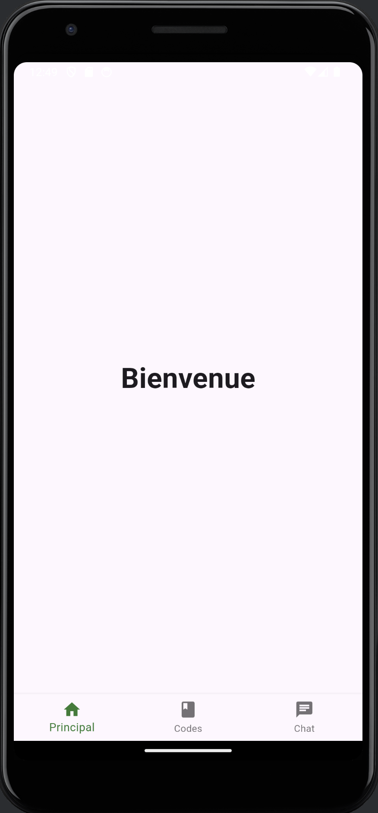
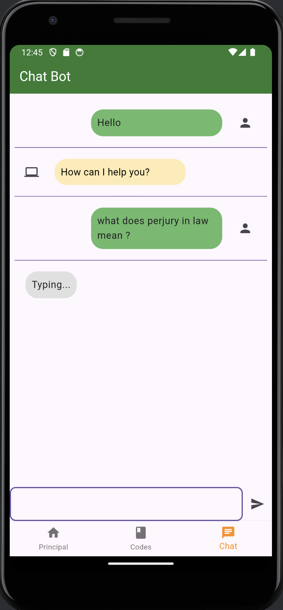
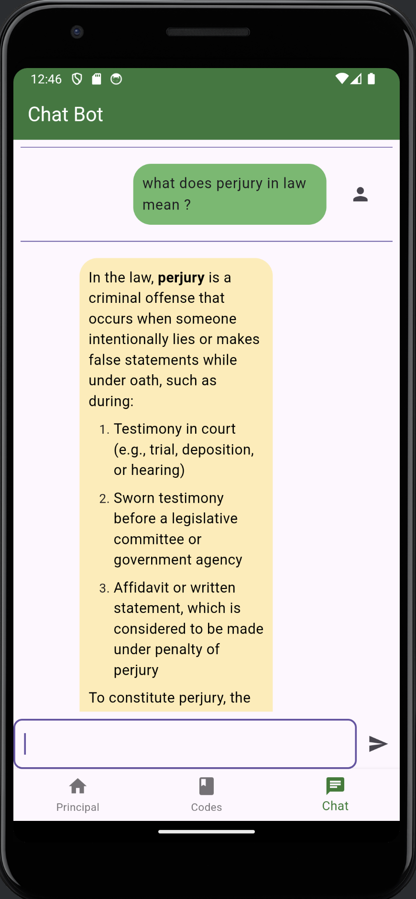

# Law App

## Overview

The Law App is a comprehensive application designed to store, analyze, and facilitate the search of law literature through an AI assistant. It provides an intuitive interface to interact with legal documents and seek assistance on legal queries.

### Features

- **PDF Document Viewer**: Browse and view various law codes and documents.
- **AI Assistant**: Ask legal questions and receive real-time responses from an AI-powered assistant.
- **Markdown Rendering**: Display formatted responses for better readability.

## Screenshots

### Home Page



The home page provides access to various legal texts and the AI chat functionality.

## Chat Interface

The chat interface allows users to interact with the AI assistant by asking questions.

### Typing Indicator



Shows when the AI is processing and generating a response.

### AI Response



Displays the AI’s response to user queries.

## Installation

1. **Clone the Repository**:
   ```bash
   git clone https://github.com/JsFn99/LawAppAi
   cd law-app
   ```

2. **Install Dependencies**:
   ```bash
   flutter pub get
   ```

3. **Run the App**:
   ```bash
   flutter run
   ```

## Usage

### Viewing Legal Documents

1. Navigate to the **Textes de loi** section from the home page.
2. Select a legal document from the list.
3. The document will open in a PDF viewer.

### Interacting with the AI Assistant

1. Enter your legal query in the text input field on the chat page.
2. Press the send button to submit your question.
3. The AI will process the query and provide a response.

## Code Structure

- **`lib/main.dart`**: Entry point of the application.
- **`lib/chat_page.dart`**: Implements the chat interface with the AI assistant.
- **`lib/laws_page.dart`**: Implements the PDF viewer and document list.
- **`lib/pdf_viewer_page.dart`**: PDF viewer page to display selected documents.

## Dependencies

- `flutter`
- `http`
- `flutter_markdown`
- `path_provider` (for handling file paths)

## Contributing

Contributions are welcome! Please open an issue or submit a pull request to contribute to the project.

## License

This project is licensed under the MIT License. See the [LICENSE](LICENSE) file for details.

## Contact

For any inquiries or feedback, please reach out to [your-email@example.com](mailto:your-email@example.com).

---

Feel free to customize the details as needed, especially the repository URL, contact information, and any other specifics relevant to your project.
